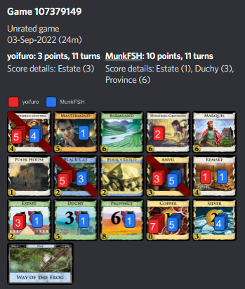

# Game 107379149

This was a game that took place between Player MunkFSH (I) and yoifuro on Sept 3rd around 8am EDT. This was our 5th game in our Season 53 League D3 match.

Although it lasted only 11 turns, this board was rather complex due to a couple key interactions.

I made an interesting play on turn 9 (decision number 128) that I would like to investigate further. View [the notebook](https://github.com/cvraut/dominion_simulations/blob/main/games/107379149/black_cats_mia.ipynb) to learn more.