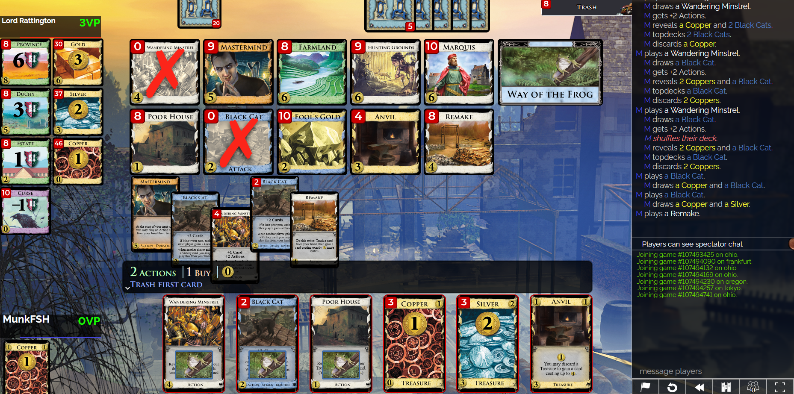

# Game 107379149

This was a game that took place between Player MunkFSH (I) and yoifuro on Sept 3rd around 8am EDT. This was our 5th game in our Season 53 League D3 match.

Although it lasted only 11 turns, this board was rather complex due to a couple key interactions.

I made an interesting play on turn 9 (decision number 128) that I would like to investigate further. View [the notebook]() to learn more.

Here I played the remake to try to score some points. Because I remade my estates earlier into silvers and anvils I was down 3 points to my opponent. I needed to score at least 4 points this turn to take the lead. I was planning on converting the poor house --> estate, converting the wandering minstrel --> duchy, and purchasing a province giving myself a 7-point lead over my opponent. This would then let me top-deck 2 black cats via way of the frog effectively giving myself a 9-point lead over my opponent. I knew my opponent had 5 black cats in his deck (I had the remaining 5). The previous turn my opponent had triggered a fresh shuffle without top-decking any black cats. I figured if I could end the turn taking 3 curses or fewer, I would have a pretty good chance at finishing the game by piling anvils.

If my opponent played 3 black cats exactly, they would have 11 cards in hand with a good chance they can province + duchy, but not more than that. They would receive 2 curses from my cats leading to even points. This would lead to a tie if I can end the game on my turn.

Any fewer black cats and I would likely win due to the point advantage. Any more cats and I would lose due to the point deficit.

In the actual game my opponent had no black cats in their hand on this turn and I proceeded to win off of my point lead & by piling the anvils. This was the best case scenario for me, but this outcome was far from guaranteed. It was not a safe play, but it did get my statistical brain thinking. How likely was this scenario? How likely was the event that I would receive 2 curses or less on turn 9? How risky was my play on turn 9? How did I evaluate such a complex board state in less than a minute? And did I make a mistake during my rapid calculations?

## How likely was my opponent to not have any black cats in their starting hand? 🐱‍👤

This is a simple probability problem

## How did I evaluate such a complex board state in less than a minute? ⏱

My rational was that 5 black cats in 25 cards, I expect my opponent to have at least 1, maybe 2, very lucky if 3+ in their opening hand. I put my odds of receiving 2 curses or less at ~80%. This was not empirically driven, but in trying to apply quick gameplay reasoning... The first 5 cards can be estimated to be random samples from a binomial(p=0.2) which has an expected value of 1 with variance of 0.24. Within 2 standard deviations, we can expect to see about 2 black cats. Factoring in arithmetic errors & bad draws I gave this play about an 80% chance of working the way I wanted it to.

I thought this game was interesting because of 